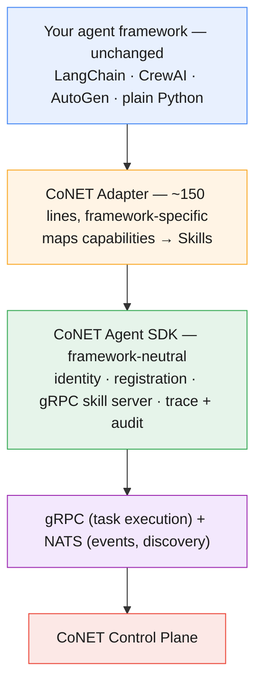
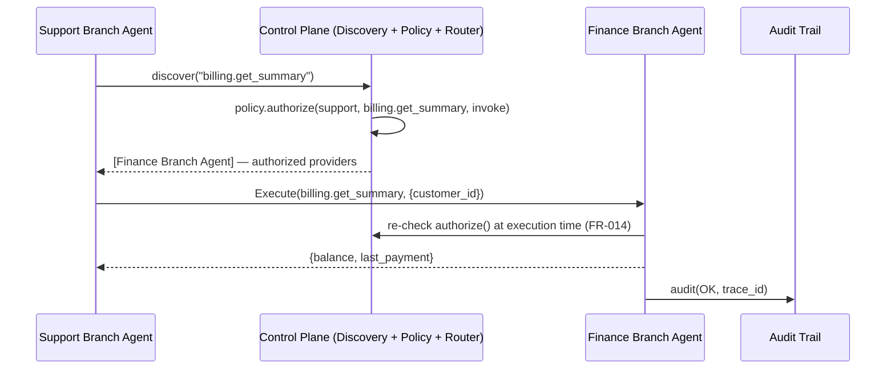
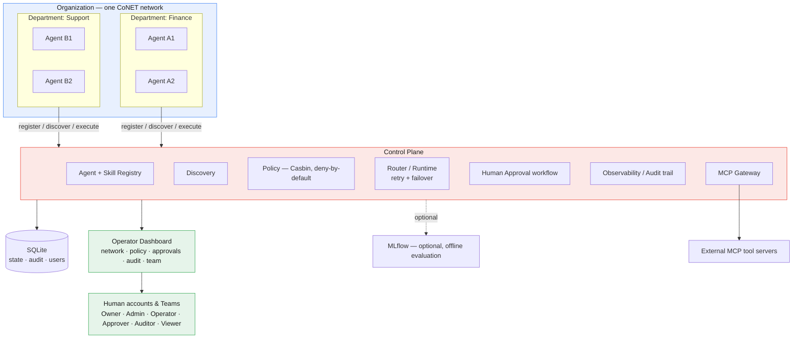

# CoNET — Colony Network

[](https://pypi.org/project/colonynet/)
[](https://pypi.org/project/colonynet/)
[](LICENSE)

**An open-source orchestration and governance layer for private, distributed AI-agent networks.**

CoNET is the network layer *around* your AI agents. It lets independently built agents — from any framework — join one private network, discover each other, call each other under policy, pause for human approval, reach external tools through a governed boundary, and leave a complete audit trail an administrator can actually read.

> Think of it this way: CoNET is to AI agents what an enterprise network — with identity, DNS, routing, firewall rules, and audit logs — is to servers. It makes a fleet of agents governable.

---

## The problem

A company has three teams shipping AI agents. Finance built one that reconciles invoices. HR built one that answers policy questions. Support built one that triages tickets. Each used a different framework, a different model, a different deployment.

Without a shared layer, none of this is safe or observable at the company level:

- The finance agent can't ask the support agent for a record without someone hard-coding an endpoint.
- There's no shared way to say *"the HR agent may read the directory but may never move money."*
- When an agent does something unexpected, no admin can see what it did, why, or on whose authority — and no human was asked before it acted.
- Every external tool each agent touches carries its own credentials, scattered across three codebases.

Industry reporting in 2026 estimates only **11–14% of enterprise agentic-AI pilots reach production** — most stall on exactly these identity, audit, and access-control gaps. CoNET is built for that gap, not the model-capability frontier.

---

## Key ideas

- **Private-network first.** Run CoNET entirely inside your own environment. No third-party dependency to operate it.
- **Framework-neutral.** LangChain, CrewAI, AutoGen, or plain Python — agents join through a thin adapter (the network-interface-card model). CoNET can't tell them apart except by the Skills they declare.
- **Permission-aware discovery.** Knowing a Skill exists doesn't grant permission to use it.
- **Deny-by-default policy.** Least privilege across organization → department → agent → Skill → action, enforced with [Casbin](https://casbin.org/) on every call — not just at discovery time.
- **Human control.** High-risk tasks can wait for approval; admins can cancel a task or pause an agent without stopping the network.
- **One managed boundary for external tools.** External MCP servers connect through a central gateway — credentials never touch ordinary agents, logs, or traces.
- **Observable and auditable.** Every task is traceable end to end; every significant action writes an audit record.

---

## Installation

The distribution name on PyPI is `colonynet`; the importable package and CLI command are both `conet`.

```bash
pip install colonynet
```

Optional extras, installed only if you need them:

```bash
pip install "colonynet[mcp]"      # connect to external MCP tool servers (the gateway)
pip install "colonynet[webhook]"  # onboard a non-MCP vendor/third-party agent over plain REST
pip install "colonynet[eval]"     # offline agent/model evaluation via MLflow
pip install "colonynet[dev]"      # pytest, ruff, mypy — for contributing
```

CoNET's event plane runs on [NATS](https://nats.io/). For local development, run a server with Docker:

```bash
docker run -d --name nats -p 4222:4222 nats:latest -js
```

Agent state, tasks, audit records, and human accounts are stored in **SQLite** via `aiosqlite` — no external database service to stand up (see `docs/adr-log.md`).

---

## Quickstart

Register an agent, publish one Skill, and let CoNET handle identity, registration, the gRPC skill server, and trace/audit — all with a NATS server running locally (see [Installation](#installation)):

```python
from conet.sdk import Agent, SkillDef, run

class InvoiceAdapter:
    def describe(self):
        return Agent.manifest(
            name="invoice-checker", framework="langchain",
            department="finance",
            version="1.0.0", endpoint="grpc://localhost:50201", identity_ref="cert-1",
            skills=[SkillDef(
                skill_id="invoice.verify", version="1.0.0",
                side_effects="read_only",
                input_schema={"type": "object",
                    "properties": {"invoice_id": {"type": "string"}},
                    "required": ["invoice_id"]},
                output_schema={"type": "object",
                    "properties": {"valid": {"type": "boolean"}}},
            )],
        )

    async def invoke(self, skill_id, payload):        # the only framework-aware line
        return {"valid": True}

run(InvoiceAdapter())   # blocks; SDK handles identity, registration, gRPC, trace, audit
```

From another terminal, inspect the running network with the CLI:

```bash
conet status                 # control plane reachability + active agent count
conet agents                 # registered agents, department, framework, endpoint
conet skills                 # published skills and which agent provides each
conet cancel <task_id>       # cancel a running task on its provider
```

See [`docs/00-lld01-manifest-and-adapter.md`](docs/00-lld01-manifest-and-adapter.md) for the full manifest and adapter contract (LLD-01), including `stream()` and `on_cancel()` for long-running or cancellable Skills.

---

## Integration guide

Every example below follows the same shape as the Quickstart: implement `describe()` (a manifest + Skills) and `invoke()` (call into whatever you already built), then `run(...)`. The framework-specific code below is illustrative of the integration pattern — LangGraph, LangChain, and CrewAI aren't dependencies of this package, so wire the actual import/invocation up to match your version.

### LangGraph

Your compiled graph doesn't change; the adapter just calls it.

```python
from conet.sdk import Agent, SkillDef, run

# compiled_graph = my_existing_graph.compile() — built exactly as it is today

class SupportTriageAdapter:
    def describe(self):
        return Agent.manifest(
            name="support-triage", framework="langgraph", department="support",
            version="1.0.0", endpoint="grpc://localhost:50210", identity_ref="cert-support-1",
            skills=[SkillDef(
                skill_id="support.triage_ticket", version="1.0.0",
                side_effects="read_only",
                input_schema={"type": "object",
                    "properties": {"ticket_text": {"type": "string"}}, "required": ["ticket_text"]},
                output_schema={"type": "object",
                    "properties": {"priority": {"type": "string"}, "category": {"type": "string"}}},
            )],
        )

    async def invoke(self, skill_id, payload):         # the only framework-aware line
        result = await compiled_graph.ainvoke({"ticket": payload["ticket_text"]})
        return {"priority": result["priority"], "category": result["category"]}

run(SupportTriageAdapter())
```

### LangChain

```python
from conet.sdk import Agent, SkillDef, run

# my_chain = an existing LCEL chain or AgentExecutor

class InvoiceChainAdapter:
    def describe(self):
        return Agent.manifest(
            name="invoice-checker", framework="langchain", department="finance",
            version="1.0.0", endpoint="grpc://localhost:50211", identity_ref="cert-finance-1",
            skills=[SkillDef(
                skill_id="invoice.verify", version="1.0.0", side_effects="read_only",
                input_schema={"type": "object",
                    "properties": {"invoice_id": {"type": "string"}}, "required": ["invoice_id"]},
                output_schema={"type": "object", "properties": {"valid": {"type": "boolean"}}},
            )],
        )

    async def invoke(self, skill_id, payload):
        result = await my_chain.ainvoke({"invoice_id": payload["invoice_id"]})
        return {"valid": bool(result["valid"])}

run(InvoiceChainAdapter())
```

### CrewAI

CrewAI's `kickoff()` is synchronous, so it's offloaded to a thread rather than blocking the adapter's event loop.

```python
import asyncio
from conet.sdk import Agent, SkillDef, run

# my_crew = an existing Crew(...)

class ResearchCrewAdapter:
    def describe(self):
        return Agent.manifest(
            name="research-crew", framework="crewai", department="marketing",
            version="1.0.0", endpoint="grpc://localhost:50212", identity_ref="cert-marketing-1",
            skills=[SkillDef(
                skill_id="research.brief", version="1.0.0", side_effects="read_only",
                input_schema={"type": "object",
                    "properties": {"topic": {"type": "string"}}, "required": ["topic"]},
                output_schema={"type": "object", "properties": {"summary": {"type": "string"}}},
            )],
        )

    async def invoke(self, skill_id, payload):
        result = await asyncio.to_thread(my_crew.kickoff, inputs={"topic": payload["topic"]})
        return {"summary": str(result)}

run(ResearchCrewAdapter())
```

### Central MCP Gateway

One connected boundary for external MCP tool/agent servers — connect once, credentials stay isolated in the gateway's own subprocess, and every call through it is policy-checked and audited the same way an internal Skill call is:

```python
from conet.control.policy import PolicyEngine
from conet.gateway.mcp.gateway import MCPGateway
from conet.persistence.store import Store

store = Store("conet.db")
policy = PolicyEngine(secret_key="prod-secret")
gateway = MCPGateway(policy, store)

await gateway.connect_server(
    "internal-crm", command="npx", args=["-y", "@your-org/crm-mcp-server"],
    env={"CRM_API_KEY": "..."},   # credentials live only in this subprocess env
)
skills = await gateway.import_capabilities("internal-crm")   # -> list[SkillDef]
```

From here, an imported capability is reachable two ways. Directly, by any code holding `gateway` — the dashboard's Integrations panel, an orchestrator process:

```python
result = await gateway.invoke_external_capability(
    requester="support-triage", skill_id="mcp.internal-crm.lookup_customer",
    payload={"customer_id": "C-4471"},
)
```

Or as a first-class, discoverable colony member — wrap the gateway in a `GatewayAdapter` and run it like any other agent, and every imported capability becomes reachable through the ordinary `Router` (`router.execute(requester, skill_id, payload)`), policy-checked and audited by the same `SkillServer` path a hand-built adapter's Skills use:

```python
from conet.gateway.mcp.adapter import GatewayAdapter
from conet.sdk import run

adapter = GatewayAdapter(gateway, skills, endpoint="grpc://localhost:50230")
run(adapter)   # mcp.internal-crm.lookup_customer now shows up in `conet skills`
```

### Your own RAG project

Split retrieval and generation into two governed Skills instead of one opaque pipeline function, and every answer gets its own audit trail — which chunks were retrieved, by whom, and what the generator did with them — instead of just "the RAG pipeline ran":

```python
from conet.sdk import Agent, SkillDef, run

class RetrieverAdapter:
    def describe(self):
        return Agent.manifest(
            name="rag-retriever", framework="plain", department="knowledge",
            version="1.0.0", endpoint="grpc://localhost:50220", identity_ref="cert-know-1",
            skills=[SkillDef(
                skill_id="rag.retrieve", version="1.0.0", side_effects="read_only",
                input_schema={"type": "object",
                    "properties": {"query": {"type": "string"}}, "required": ["query"]},
                output_schema={"type": "object", "properties": {"chunks": {"type": "array"}}},
            )],
        )

    async def invoke(self, skill_id, payload):
        chunks = my_vector_store.similarity_search(payload["query"], k=5)
        return {"chunks": [c.page_content for c in chunks]}

run(RetrieverAdapter())
```

```python
class GeneratorAdapter:
    def describe(self):
        return Agent.manifest(
            name="rag-generator", framework="plain", department="knowledge",
            version="1.0.0", endpoint="grpc://localhost:50221", identity_ref="cert-know-2",
            skills=[SkillDef(
                skill_id="rag.generate", version="1.0.0", side_effects="read_only",
                input_schema={"type": "object",
                    "properties": {"query": {"type": "string"}, "chunks": {"type": "array"}},
                    "required": ["query", "chunks"]},
                output_schema={"type": "object", "properties": {"answer": {"type": "string"}}},
            )],
        )

    async def invoke(self, skill_id, payload):
        answer = await my_llm.ainvoke(build_prompt(payload["query"], payload["chunks"]))
        return {"answer": answer}

run(GeneratorAdapter())
```

A caller — your app, or a third orchestrator agent — discovers and calls `rag.retrieve` then `rag.generate` through the same `Router` the CLI uses (`conet skills` will list both). Both hops share one `trace_id`, so the Audit panel shows the full retrieval → generation chain behind every answer.

---

## Our philosophy

> *"Software and technology is meant to be built to adapt to the structures and the workflows that already work, and make them cheaper, faster, and more efficient. It does not need to bend them."*

Every organization already has a working structure — departments, branches, sign-off chains, who's allowed to ask whom for what. CoNET doesn't ask you to redesign that structure around one framework's opinions. It models the org chart you already have, and lets agents — built in whatever framework each team already chose — operate inside it as governed participants.

The [adapter model](#how-an-agent-joins-the-adapter-model) below is this philosophy made concrete: your agent's code doesn't change to fit CoNET. A thin adapter fits CoNET around your agent.

---

## How an agent joins (the adapter model)

An agent doesn't *become* a CoNET agent any more than a laptop *becomes* the network it joins. It plugs in through a thin adapter that gives it a network identity and translates its capabilities into Skills. Inside the adapter, the agent stays exactly what it was.



---

## Why CoNET is a new layer, not another framework

CoNET doesn't replace the tools you already use — it governs them.

| Layer | Owns | Example |
| --- | --- | --- |
| **Reasoning framework** | How one agent thinks and uses its own tools | LangGraph, CrewAI, AutoGen |
| **Agent-to-tool** | How an agent reaches an external tool | MCP |
| **Agent-to-agent** | How two agents exchange a task | A2A |
| **CoNET** | In one organization: which agents exist, what they may do, who may call whom, which actions need a human, and what happened — provably | *this project* |

MCP is great at what it does — a *dose* of connection from one agent out to an external tool or agent, point to point. It doesn't ask "should this agent be allowed to reach this tool at all," or "who signs off if it wants to," or "prove what happened six weeks later." That's a different, org-wide question, and it's the one CoNET answers: it structures your agents, models them, and enforces them like any other employee following a department's or branch's rules — not just wiring one connection at a time. See [the mental model](#the-mental-model-agents-as-employees) below.

Agent-to-tool (MCP) and agent-to-agent (A2A) delegation are largely solved and standardized. **Organization-level governance of an agent fleet is not** — it's a missing architectural layer, not a missing feature. CoNET occupies that layer, and imports the solved pieces rather than rebuilding them.

---

## The mental model: agents as employees

The clearest way to think about what CoNET manages is to stop thinking about "agents" and start thinking about **employees**:

| A human employee has… | A CoNET agent has… |
| --- | --- |
| A department or branch they belong to | `department` in its manifest |
| A job description — what they're allowed to do | Skills — declared capabilities, each explicitly read-only or a write |
| Access rules — what systems/records they can touch | Deny-by-default Casbin policy, checked on every call |
| A manager who signs off on high-risk actions | The human approval queue (see [Scenario: branch-to-branch requests](#scenario-branch-to-branch-requests)) |
| A timesheet / paper trail | An audit record for every significant action |
| Working hours | None — agents run 24/7; the controls are what makes that safe |

Framed this way, cross-team collaboration is exactly what it is in a real org: Support doesn't get to walk into Finance's systems unsupervised — it asks, gets checked against policy, and for anything sensitive, waits for a human, same as a human employee would. One Branch agent can request information from another branch and get work done easily, and employees that operate 24/7 still get that work done under structured controls, not despite them.

---

## Scenario: branch-to-branch requests

Two branches, one policy-checked, audited request:



```python
providers = await router.select_providers(requester="support-triage", skill_id="billing.get_summary")
response = await router.execute(requester="support-triage", skill_id="billing.get_summary",
                                 payload={"customer_id": "C-4471"})
```

No hard-coded endpoint, no shared credentials — Support never sees how Finance is deployed, only that `billing.get_summary` exists and it's authorized to call it.

**When it needs a human.** Not every cross-branch request should go straight through. For anything higher-risk — Finance issuing a refund on Support's behalf, say — declare the Skill `side_effects="unsafe_write"` and pass the approvers when starting the agent; nothing else about the adapter changes:

```python
run(FinanceRefundAdapter(), approvers=["finance-manager@example.com"])
```

`Execute()` itself now pauses `finance.issue_refund` at the approval gate before `invoke()` ever runs: the task moves to `WAITING_APPROVAL`, a human decides via the dashboard's Approvals panel or the CLI (`conet approve <approval_id> --by finance-manager@example.com`, or `conet reject ...`), and the gRPC call only returns once that decision lands — approved, rejected, or timed out. This is opt-in per agent, not a global switch: Skills that aren't `unsafe_write`, and agents started without `approvers`, are never gated.

**The advantages this gives you:**

- 24/7 execution with the same controls a human employee has — no branch is unsupervised just because no one's watching at 2am.
- No hard-coded point-to-point integrations between teams' agents — a new branch registers once and inherits the org's policy model, instead of every team renegotiating access with every other team.
- One place to answer "who can talk to whom, and did they" — instead of three teams' worth of scattered logs.
- Every cross-branch action is auditable after the fact, tied to a `trace_id`, not just logged by whichever team happened to remember to add logging.

---

## Governing third-party and vendor agents

Your organization won't build every agent in-house. If a mainstream vendor's agent — a startup's SaaS product, a platform's built-in agent — needs to participate:

**If it speaks MCP, this works today.** Connect it as an external server through the [MCP Gateway](#central-mcp-gateway): every call to it is policy-checked and audited exactly like a call to an internal agent, and its credentials never leave the gateway's subprocess. This is the intended shape for exactly this problem — MCP standardizes *how* you reach an external agent or tool; CoNET governs *whether* you're allowed to, and proves that you did.

**If it doesn't speak MCP — only a plain REST/webhook API — this works today too.** `WebhookAdapter` (`pip install "colonynet[webhook]"`) onboards it declaratively: register the vendor's endpoint, a fixed auth header, and input/output schemas as configuration, no code, and CoNET treats it as a Skill like any other — policy-checked, audited, and approval-gateable (see [above](#scenario-branch-to-branch-requests)) for its higher-risk actions:

```python
from conet.gateway.webhook import WebhookAdapter, WebhookSkill
from conet.sdk import SkillDef, run

adapter = WebhookAdapter(
    [WebhookSkill(
        skill=SkillDef(
            skill_id="vendor.get_balance", version="1.0.0", side_effects="read_only",
            input_schema={"type": "object",
                "properties": {"customer_id": {"type": "string"}}, "required": ["customer_id"]},
            output_schema={"type": "object", "properties": {"balance": {"type": "number"}}},
        ),
        url="https://vendor.example.com/customers/{payload[customer_id]}",
        headers={"Authorization": "Bearer vendor-secret"},   # fixed at config time, never from the caller's payload
    )],
    endpoint="grpc://localhost:50240", name="vendor-balance-lookup", department="finance",
)
run(adapter)
```

---

## Architecture at a glance



**Built on:** Python · FastAPI · gRPC · NATS · SQLite (`aiosqlite`) · Casbin (policy) · OpenTelemetry (observability) · the official MCP SDK (external tools) · `fastapi-users` (human accounts). Server-rendered operator dashboard (Jinja2). Optional MLflow for offline agent/model evaluation.

---

## Operator dashboard

A server-rendered FastAPI app for humans: seven panels — **network**, **traffic**, **policy**, **approvals**, **audit**, **integrations** (MCP servers), and **team** — each gated by role (`Owner`/`Admin`/`Operator`/`Approver`/`Auditor`/`Viewer`).

The network map renders a live SVG graph of every registered agent — node color by department, edges showing who's been calling whom, edge thickness by recent call volume, edge color escalating from grey to amber to red as that pair's most recent task state gets worse. It, live traffic, and the audit log all poll a small JSON API every few seconds and re-render — plain inline SVG and vanilla JS, no charting library — so the dashboard stays dependency-light.

```python
import uvicorn
from conet.dashboard.app import create_dashboard_app
from conet.dashboard.services import build_services

services = build_services()  # reads CONET_DB_PATH, CONET_NATS_URL, etc. — see below
app = create_dashboard_app(services)

uvicorn.run(app, host="0.0.0.0", port=8000)
```

---

## Configuration

Everything is environment-driven with sane local defaults — no config file required to get started.

| Variable | Default | Purpose |
| --- | --- | --- |
| `CONET_DB_PATH` | `conet.db` | SQLite file for agent/task/audit state |
| `CONET_USERS_DB_PATH` | `conet_users.db` | SQLite file for human accounts |
| `CONET_NATS_URL` | `nats://localhost:4222` | NATS server for events and discovery |
| `CONET_POLICY_SECRET` | `dev-secret-change-me` | HMAC secret signing agent auth contexts — **set this in production** |
| `CONET_POLICY_PATH` | *(built-in default policy)* | Path to a Casbin agent-policy CSV |
| `CONET_AUTH_SECRET` | `dev-secret-change-me` | Secret signing human dashboard sessions — **set this in production** |
| `CONET_DASHBOARD_INSECURE_COOKIES` | *(unset)* | Set to `1` only for plain-HTTP local dev; dashboard cookies are `Secure` by default |
| `CONET_MLFLOW_TRACKING_URI` | `sqlite:///mlflow.db` | MLflow tracking backend (requires the `eval` extra) |
| `CONET_MLFLOW_UI_URL` | `http://localhost:5000` | Where `mlflow ui` is served, for dashboard links |

---

## Documentation

The full specification set is public in [`docs/`](docs/) (canonical reference, with a table of contents) and mirrored in [`context/`](context/) (the same content, formatted for feeding to an LLM):

- [`01-project-overview.md`](docs/01-project-overview.md) — problem, positioning, principles, scope.
- [`02-srs.md`](docs/02-srs.md) — Software Requirements Specification: functional & non-functional requirements.
- [`03-architecture-and-implementation-plan.md`](docs/03-architecture-and-implementation-plan.md) — research spikes, decisions, stage plan, benchmarks.
- [`00-lld01-manifest-and-adapter.md`](docs/00-lld01-manifest-and-adapter.md) — LLD-01: how any framework's agent plugs in.
- [`04-feature-and-package-plan.md`](docs/04-feature-and-package-plan.md) — every feature, its packages, and build order.
- [`05-build-sequence.md`](docs/05-build-sequence.md) — the exact prototype → production build order the implementation followed.
- [`adr-log.md`](docs/adr-log.md) — architecture decision log (e.g. why SQLite over MongoDB, the grpcio/protobuf version pin).

---

## Contributing

CoNET is built in the open. Useful things you can do right now:

- **Open an issue** with a use case, a bug, a design question, or a challenge to an architecture decision.
- **Run the test suite** (`pip install -e ".[dev]"` then `pytest`) and send a PR.
- **Star and watch** to follow progress.

A `CONTRIBUTING.md` with fuller contributor guidelines is on the way. Until it lands, an issue is the best way to start a conversation before a PR.

---

## License

CoNET is released under the [Apache License 2.0](LICENSE) — free to use, modify, and build on, including commercially, with attribution. See [`LICENSE`](LICENSE) for the full text.

---

## Author

Built by **Prince Mawuko Dzorkpe** — software engineer specializing in agentic AI systems, RAG, and backend infrastructure.

- Portfolio: https://www.kobbyprime.online/
- GitHub: https://github.com/PM-Devs

---

<sub>CoNET — governing colonies of agents, framework-neutral, inside your own network.</sub>
